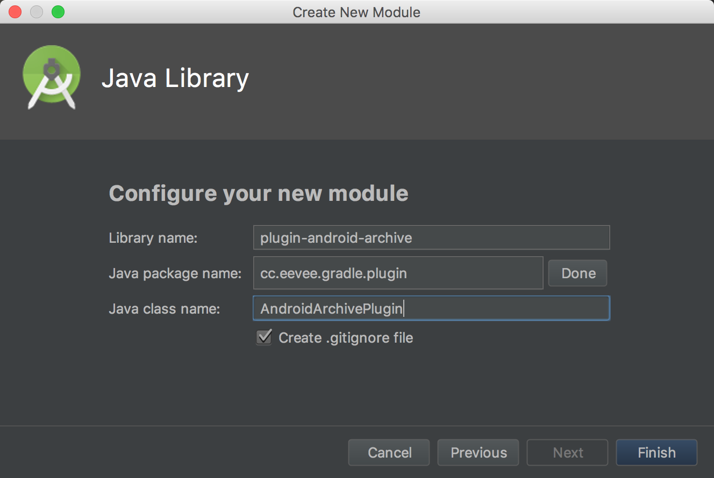
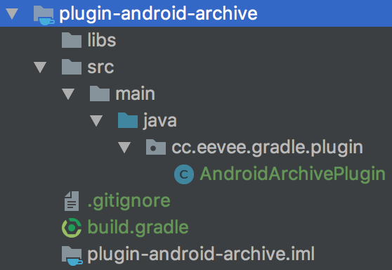

# 如何实现 Android 项目的 Gradle 插件

## 前言

此篇文章是以实例的形式介绍如何在 Android Studio 下开发 Gradle 插件。主要包括如下几点：

* 如何于 Android 工程结构里添加 Gradle 开发子项目
* 如何获取 Android 插件的配置信息，即 `android {}` 里的东西
* 如何将插件发布到 Nexus & JCenter ，并于其他工程引用

此篇文章不会介绍 Gradle 插件开发的概念，如 Task, Extension, Convention 等。

深入开发，请自行阅读 Gradle 插件开发的官方教程：

* [Implementing Gradle plugins](https://guides.gradle.org/implementing-gradle-plugins/)
* [Writing Custom Plugins](https://docs.gradle.org/current/userguide/custom_plugins.html)

此篇文章的实例为：实现一个给 Android 模块提供源码和文档打包功能的插件。

## 准备

* Android Studio

## 开始

首先，新建 Android 项目，或者打开已有项目。

然后，新建 Module ，选择 Java Library ，



模块创建完成后，其内容结构如下，



接着，打开 `build.gradle` ，修改成 Gradle 插件开发子模块，

```gradle
plugins {
  id 'java-gradle-plugin'
}

gradlePlugin {
  plugins {
    androidArchivePlugin {
      id = 'cc.eevee.gradle.plugin.android-archive'
      implementationClass = 'cc.eevee.gradle.plugin.AndroidArchivePlugin'
    }
  }
}

version = '1.0.0'

dependencies {
  compileOnly 'com.android.tools.build:gradle:3.1.4'
}
```

这里用了 `java-gradle-plugin` 来配置插件，详见：[Gradle Plugin Development Plugin](https://docs.gradle.org/current/userguide/java_gradle_plugin.html)。

需要补充的一点是，`dependencies` 添加了 Android 的 Gradle 插件依赖，用以获取其配置信息。

到这里，我们就做好了 Gradle 插件开发的准备。

## 实现

首先，看一下如何在 Android Library 的 `build.gradle` 里添加源码和文档打包的任务：

```gradle
afterEvaluate { project ->
  task androidSourcesJar(type: Jar) {
    classifier = 'sources'
    from android.sourceSets.main.java.sourceFiles
  }

  task androidJavadoc(type: Javadoc) {
    classpath += project.files(android.getBootClasspath().join(File.pathSeparator))
    android.libraryVariants.all { variant ->
      if (variant.name == 'release') {
        owner.classpath += variant.javaCompile.classpath
      }
    }
    source = android.sourceSets.main.java.srcDirs
    options.addStringOption('Xdoclint:none', '-quiet')
    options.addStringOption('encoding', 'UTF-8')
    options.addStringOption('charset', 'UTF-8')
    exclude '**/R.java'
    failOnError false
  }

  task androidJavadocJar(type: Jar, dependsOn: androidJavadoc) {
    classifier = 'javadoc'
    from androidJavadoc.destinationDir
  }

  artifacts {
    archives androidSourcesJar
    archives androidJavadocJar
  }
}
```

那么，插件开发的任务就只是翻译上述代码罢了。接下来，一步步的实现吧。

### 获取 Android 配置信息

```java
public class AndroidArchivePlugin implements Plugin<Project> {

  @Override
  public void apply(Project project) {
    // afterEvaluate 时，再创建打包任务
    project.afterEvaluate(this::createTasks);
  }

  private void createTasks(Project project) {
    // 获取 Android 配置信息（包括了应用和库）
    AndroidConfig androidConfig = project.getExtensions().getByType(AndroidConfig.class);

    // 获取 Android Java 源文件
    androidConfig.getSourceSets().getByName("main", androidSourceSet -> {
      FileTree javaSourceFiles = androidSourceSet.getJava().getSourceFiles();

      // 创建任务 ...
    });
  }
}
```

### 创建源码打包任务 `androidSourcesJar`

```java
logger.verbose("Create androidSourcesJar task");
Jar androidSourcesJar = project.getTasks().create(
    "androidSourcesJar", Jar.class, task -> {
      task.setClassifier("sources");
      task.from(javaSourceFiles);
    });
```

### 创建文档任务 `androidJavadoc`

```java
logger.verbose("Create androidJavadoc task");
Javadoc androidJavadoc = project.getTasks().create(
    "androidJavadoc", Javadoc.class, task -> {
      // 配置 Javadoc 的 Classpath
      if (androidConfig instanceof BaseExtension) {
        BaseExtension baseExt = (BaseExtension) androidConfig;
        task.setClasspath(project.files(baseExt.getBootClasspath()));
      }

      // Android 库时，才可获取 LibraryVariants 进一步配置
      if (androidConfig instanceof LibraryExtension) {
        LibraryExtension libExt = (LibraryExtension) androidConfig;
        libExt.getLibraryVariants().all(variant -> {
          if (variant.getName().equals("release")) {
            Task t = variant.getJavaCompiler();
            if (t instanceof JavaCompile) {
              task.getClasspath().add(((JavaCompile) t).getClasspath());
            }
          }
        });
      }

      // 设置 Source
      task.setSource(androidSourceSet.getJava().getSrcDirs());

      // 设置 Javadoc Options
      MinimalJavadocOptions options = task.getOptions();
      options.setEncoding("UTF-8");
      if (options instanceof StandardJavadocDocletOptions) {
        StandardJavadocDocletOptions stdOptions = (StandardJavadocDocletOptions) options;
        stdOptions.addStringOption("Xdoclint:none", "-quiet");
        stdOptions.setCharSet("UTF-8");
      }

      // 排除 R.java
      task.exclude("**/R.java");
      // 错误时继续执行
      task.setFailOnError(false);
    });
```

### 创建文档打包任务 `androidJavadocJar`

```java
logger.verbose("Create androidJavadocJar task");
Jar androidJavadocJar = project.getTasks().create("androidJavadocJar", Jar.class, task -> {
  task.setClassifier("javadoc");
  task.from(androidJavadoc.getDestinationDir());
});
// androidJavadocJar 依赖 androidJavadoc
androidJavadocJar.dependsOn(androidJavadoc);
```

### 打包任务添加进 `artifacts`

```java
logger.verbose("Add archives to artifacts");
project.getArtifacts().add("archives", androidJavadocJar);
project.getArtifacts().add("archives", androidSourcesJar);
```

到这里，插件功能就完成了。

## 发布

如果要发布到 Gradle Plugin Portal ，请参考如下文档：

* How do I use the Plugin Publishing Plugin?
  * https://plugins.gradle.org/docs/publish-plugin
  * https://plugins.gradle.org/plugin/com.gradle.plugin-publish

这里只介绍如何将插件发布到 Nexus 和 JCenter ，用的插件是 [Gradle Maven Publication](https://github.com/kaedea/gradle-maven-publication) 。

### 配置隐私属性

配置如下隐私属性到全局 `$HOME/.gradle/gradle.properties` ，

```gradle
RELEASE_REPOSITORY_URL=http://localhost:8081/repository/maven-releases/
SNAPSHOT_REPOSITORY_URL=http://localhost:8081/repository/maven-snapshots/
NEXUS_USERNAME=admin
NEXUS_PASSWORD=admin123

BINTRAY_USERNAME=eevee
BINTRAY_API_KEY=****************************************
BINTRAY_REPO=maven
```

### 引入插件

编辑根项目的 `build.gradle` 引入 `Gradle Maven Publication` 插件，

```gradle
buildscript {
  dependencies {
    classpath 'com.kaedea:publication:0.3.2'
  }
}
```

### 配置模块属性

编辑模块的 `build.gradle` 配置发布信息，

```gradle
apply plugin: 'com.kaedea.publication'

publication {
  jarSources = true // optional
  jarJavaDoc = true // optional
  jarTests = false  // optional

  GROUP('cc.eevee.gradle')      // required
  VERSION_NAME(project.version) // required

  POM_NAME('Android Archive Gradle plugin') // optional
  POM_ARTIFACT_ID('android-archive-plugin') // optional
  POM_PACKAGING('jar')                      // optional
  POM_URL('https://github.com/joinAero/AndroidGradlePluginSamples/')    // optional
  POM_DESCRIPTION('Gradle plugin that archive the sources and javadoc') // optional

  POM_SCM_URL('https://github.com/joinAero/AndroidGradlePluginSamples/')  // optional
  POM_SCM_CONNECTION('scm:git:git://github.com/joinAero/AndroidGradlePluginSamples.git')         // optional
  POM_SCM_DEV_CONNECTION('scm:git:ssh://git@github.com:joinAero/AndroidGradlePluginSamples.git') // optional

  POM_LICENCE_NAME('The Apache Software License, Version 2.0')      // optional
  POM_LICENCE_URL('http://www.apache.org/licenses/LICENSE-2.0.txt') // optional
  POM_LICENCE_DIST('repo')                                          // optional

  POM_DEVELOPER_ID('joinAero')   // optional
  POM_DEVELOPER_NAME('joinAero') // optional

  uploadToBintray = true
}
```

### 发布到 Nexus & JCenter

于 Android Studio 右侧 Grade 边栏，运行 `uploadArchives` 上传 `Nexus` ，运行 `bintrayUpload` 上传 `JCenter` 。

```bash
gradle :uploadArchives
gradle :bintrayUpload
```

此后，在其他项目里，即可直接应用了。

```gradle
buildscript {
  repositories {
    jcenter()
  }
  dependencies {
    classpath 'cc.eevee.gradle:android-archive-plugin:1.0.0'
  }
}

apply plugin: 'android-archive'
```

## 结语

如何在 Android Studio 下开发 Gradle 插件就介绍到此了。
